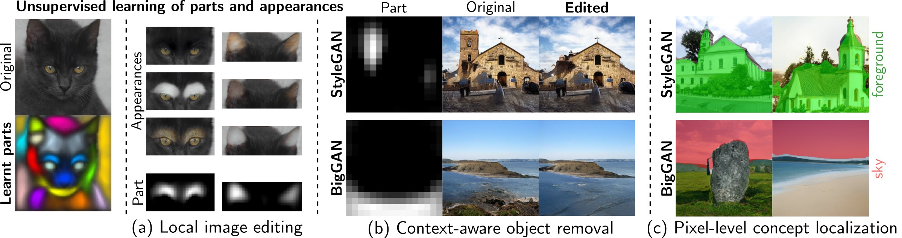
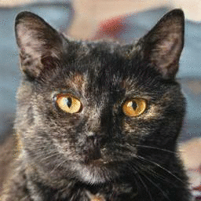
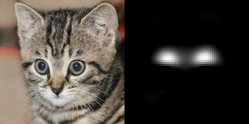
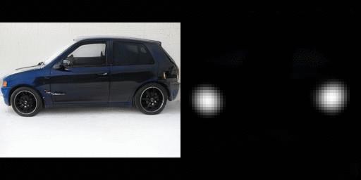
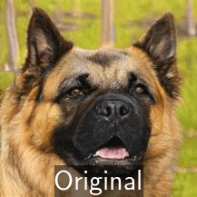
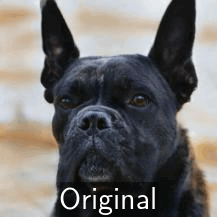
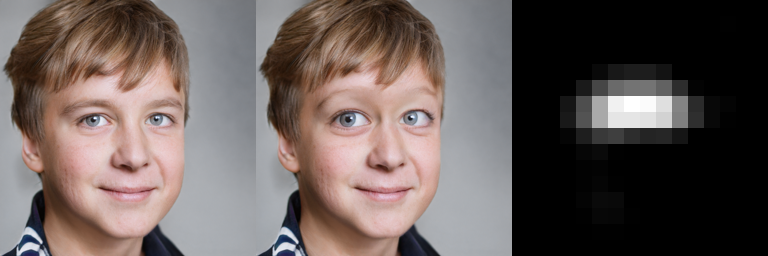

# PandA: Unsupervised Learning of Parts and Appearances in the Feature Maps of GANs

## [ [paper](https://arxiv.org/pdf/2206.00048.pdf) | [project page](http://eecs.qmul.ac.uk/~jo001/PandA/) | [video](https://www.youtube.com/watch?v=1KY055goKP0) | [edit zoo](https://colab.research.google.com/github/james-oldfield/PandA/blob/main/ffhq-edit-zoo.ipynb) | [](https://colab.research.google.com/github/james-oldfield/PandA/blob/main/demo.ipynb) ]



> **PandA: Unsupervised Learning of Parts and Appearances in the Feature Maps of GANs**<br>
> James Oldfield, Christos Tzelepis, Yannis Panagakis, Mihalis A. Nicolaou, and Ioannis Patras<br>
> https://arxiv.org/abs/2206.00048 <br>
>
> **Abstract**: Recent advances in the understanding of Generative Adversarial Networks (GANs) have led to remarkable progress in visual editing and synthesis tasks, capitalizing on the rich semantics that are embedded in the latent spaces of pre-trained GANs. However, existing methods are often tailored to specific GAN architectures and are limited to either discovering global semantic directions that do not facilitate localized control, or require some form of supervision through manually provided regions or segmentation masks. In this light, we present an architecture-agnostic approach that jointly discovers factors representing spatial parts and their appearances in an entirely unsupervised fashion. These factors are obtained by applying a semi-nonnegative tensor factorization on the feature maps, which in turn enables context-aware local image editing with pixel-level control. In addition, we show that the discovered appearance factors correspond to saliency maps that localize concepts of interest, without using any labels. Experiments on a wide range of GAN architectures and datasets show that, in comparison to the state of the art, our method is far more efficient in terms of training time and, most importantly, provides much more accurate localized control.


> An example of using our learnt appearances and semantic parts for local image editing.

## Experiments

We provide a number of notebooks to reproduce the experiments in the paper and to explore the model. Please see the following notebooks:

# [`./demo.ipynb`](./demo.ipynb)

This notebook contains the code to learn the parts and appearance factors at a target layer in a target GAN. Contains code for local image editing using the learnt parts, and provides code for refining the parts factors.

| Local image editing (at the learnt semantic parts) | |
| :-- | :-- |
|  | 

# [`./localize-concepts.ipynb`](./localize-concepts.ipynb)

Provides code to localize/visualize concepts of interest for a model/dataset of interest (setup for the "background" concept in `stylegan2_afhqdog512` as an example).

| Localizing the learnt "background" concept vector  |
| :-- |
|    |

# [`./ffhq-edit-zoo.ipynb`](./ffhq-edit-zoo.ipynb)

Quickly produce edits with annotated directions with pre-trained factors on FFHQ StyleGAN2.

| Local image editing: "Big eyes"  |
| :-- |
|  |

## Setup

Should you wish to run the notebooks, please consult this section below:

### Install
First, please install the dependencies with `pip install -r requirements.txt`.

### Pre-trained models
Should you wish to download the pre-trained models to run the notebooks, please first download them with:

```bash
wget -r -np -nH --cut-dirs=2 -R *index* http://eecs.qmul.ac.uk/~jo001/PandA-pretrained-models/
```

# citation

If you find our work useful, please consider citing our paper:

```bibtex
@misc{oldfield2022panda,
    title={PandA: Unsupervised Learning of Parts and Appearances in the Feature Maps of GANs},
    author={James Oldfield and Christos Tzelepis and Yannis Panagakis and Mihalis A. Nicolaou and Ioannis Patras},
    year={2022},
    eprint={2206.00048},
    archivePrefix={arXiv},
    primaryClass={cs.CV}
}
```

# contact

**Please feel free to get in touch at**: `j.a.oldfield@qmul.ac.uk`

---

## credits

- `./networks/genforce/` contains mostly code directly from [https://github.com/genforce/genforce](https://github.com/genforce/genforce).
- `./networks/biggan/` contains mostly code directly from [https://github.com/huggingface/pytorch-pretrained-BigGAN](https://github.com/huggingface/pytorch-pretrained-BigGAN).
- `./networks/stylegan3/` contains mostly code directly from [https://github.com/NVlabs/stylegan3](https://github.com/NVlabs/stylegan3).
